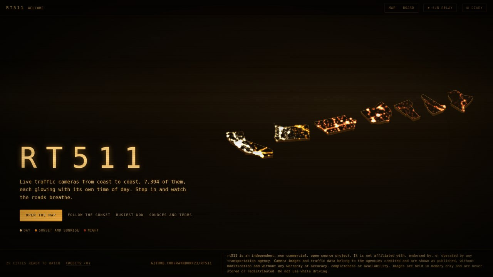
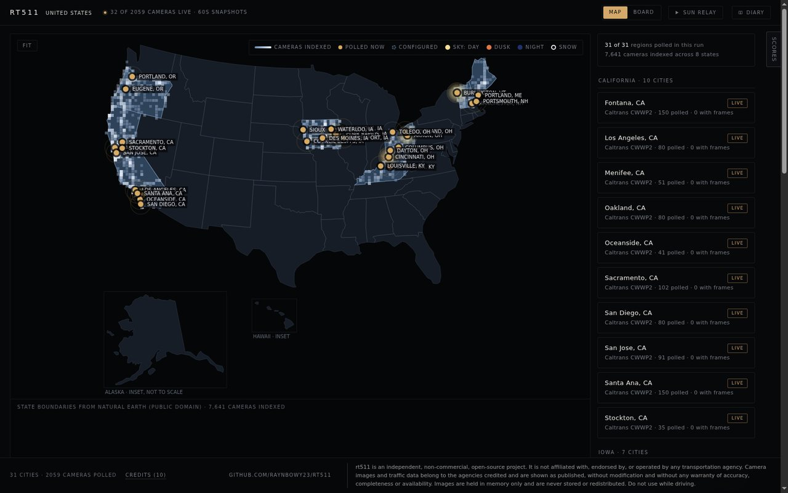
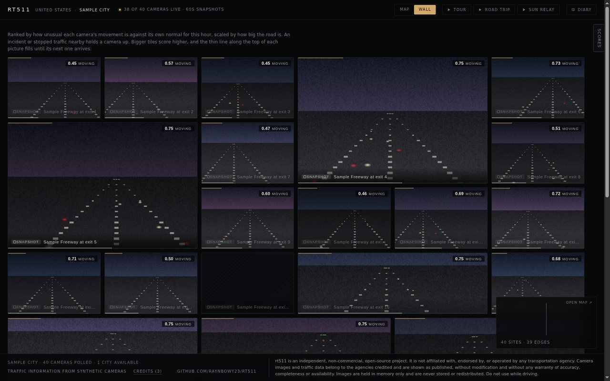

# rt511

rt511 is a demonstration of one way to decide where attention should go across a network of traffic cameras. For every camera location it asks how much that place deserves a person's attention right now, and it shows how it reached its answer.

The answer is not meant to be the right one. It comes from an equation that sets out one direction for attention: a camera deserves more of it when it is doing something unusual for that hour, when its road carries a lot of traffic, and when an incident or stopped traffic is holding it up. Other directions are equally possible, and the project is built so that they can be set beside this one. A reasoning model can take a second look at the cameras the equation ranks highest, and you can say which of two cameras you would rather watch. The equation, the model and your own choices can then be compared on the same cameras.

It is a research-flavored demonstration, not a traffic-management tool, and it makes no claim to direct attention better than any alternative. The [whitepaper](docs/rt511_visual_attention_whitepaper.md) describes the design in full and states what has and has not been measured.

The cameras are real. rt511 reads only from agencies whose written terms allow a third-party viewer to show their cameras, and only through the feeds they publish for that purpose. That covers California, Iowa, Ohio, Oregon, Maine, New Hampshire and Vermont, 7,394 cameras in all.

The interface is styled after an eighties security desk, with amber phosphor and scanlines. It opens on the covered states, lifted out of the country and floating in a row, with every camera shown as a light colored by where the sun is on it. From the map you pick a city, and its cameras are laid out on the road network and ranked on a wall. Clicking a camera opens it. A red LIVE badge marks a camera whose agency streams video, and a SNAPSHOT tag, with its refresh interval, marks one that publishes still pictures.



| The country map | A city's wall |
| --- | --- |
|  |  |

The wall shown above is a synthetic city whose pictures are drawn by the repository's mock server, so no agency's camera image is stored in this repository, as the disclaimer promises. The front page and the country map contain no camera pictures at all.

## Usage

### Quickstart

You need Node 22 or newer with pnpm, and Python 3.12 or newer with [uv](https://docs.astral.sh/uv/).

```
make setup     # installs the dependencies, then builds a road graph for each of the 29 included cities
make start     # builds the wall and serves it
```

`make setup` takes about half an hour, because the OpenStreetMap server it downloads road networks from is asked for them politely, one at a time. If it stops partway, run it again. Cities that are already built are kept.

When the server is running, open http://127.0.0.1:8511 and pick a city. Every included city works without a key. Ohio and Oregon need a free key of your own only to refresh their camera lists and, for Ohio, to read incidents, as described under [Setup and keys](#setup-and-keys).

### Setup and keys

```
uv sync
pnpm install
cp .env.example .env
```

Ohio and Oregon each need a free API key that you register for yourself under the agency's own terms, at https://publicapi.ohgo.com/docs/registration for OHGO and https://apiportal.odot.state.or.us/ for TripCheck. Put them in `.env` as `OHIODOT_API` and `OREGONDOT_API`. They are used to read the camera lists and, for Ohio, the incident feed. Images need no key. The project never ships a key, and without one those two states are simply unavailable.

`JEV_API` in the same file is optional. It turns on the second look described below. Without it, the wall is ranked by the equation alone.

### Running the wall

```
pnpm start
```

This builds the server and the wall and then serves both on http://127.0.0.1:8511. Ctrl+C stops it and releases the port. You do not have to choose a city in advance.

With no arguments, every city you have built is loaded, so the country map and every city map work straight away, but **no camera is polled until you open a city**. When you open a city its cameras start, and when you leave it they stop a couple of minutes later. A server that nobody is looking at makes no requests at all.

Arguments are passed through to the server:

```
pnpm start --regions oakland-ca,des-moines-ia    poll these cities from the start
pnpm start --cameras freeway                     poll only freeway cameras
pnpm start --port 8512                           serve on another port
pnpm start --ring 30                             keep more replay history
```

Naming cities with `--regions` polls them continuously whether or not anyone is watching, which is what you want for a screen that is left on.

| Command | What it does |
| --- | --- |
| `pnpm start` | Builds the server and the wall, then serves them. |
| `pnpm serve` | Serves the last build without rebuilding. |
| `pnpm dev` | Runs Vite with hot reload on port 5173 and the API on port 8511 together. One Ctrl+C stops both. |
| `pnpm build` | Builds without serving. |
| `pnpm check` | Type-checks every package. |

The `Makefile` wraps these commands and the `uv run rt511` pipeline commands described under [Adding a city](#adding-a-city). Run `make` on its own to list every target. `make up` runs the server and the vehicle detector together, and `make add-city CITY="Ames, IA"` creates, catalogs and builds a city in one step.

`pnpm dev` runs its two processes through `concurrently`, so their output is labeled `api` and `web`, and interrupting it stops both. The web side waits until the API answers, so a browser tab left open does not fill the log with refused connections while the server is still compiling.

### What you can do

**Which would you watch?** brings in the other side of the idea, a person's own attention. The **Which?** button in a city's top bar shows two of its cameras side by side, as pictures only, and you pick the one you would rather watch, or skip the pair. In the default Learn mode, the wall's own score for each camera is revealed after you choose. Every choice is a comparison, and a Bradley–Terry model in your browser learns from those comparisons what draws your eye. It uses the same features the equation looks at: unusual movement, road size, an incident or a queue, stopped traffic, darkness, brightness, and whether the camera is on a freeway or a street. It asks about the pairs it is least sure of, so it learns quickly. The panel beside the pictures shows what you weigh, how often you and the wall agree, and where you disagree most. After ten choices, the wall can be ranked by your attention instead of the equation. Your choices stay in your browser's local storage and are never sent anywhere, and the Export button saves them as JSON.

**Evaluate** switches Which? from learning your attention to comparing the rankings against it. Half of its pairs are drawn at random, and the other half from cameras that the equation and the second look place in opposite orders. Nothing is revealed while you choose, and the running results appear when you switch back to Learn. After exporting your choices, `uv run python scripts/evaluate_attention.py <export>.json --logs out` scores each ranking on those blind choices.

**The second look** needs `JEV_API` in `.env`. While a city is open, the Jev reasoning model looks at its eight highest-ranked cameras together every few minutes and scales each one's movement term by a factor between 0.75 and 1.25. It never changes the floor that an incident or stopped traffic puts under a camera. Every look is logged beside the equation's own order in `out/jev-<date>.jsonl`, so that the two rankings can be compared later. Without a key, the wall is ranked by the equation alone.

**Attention spreading** makes part of the scorer's reasoning visible on a city's map. When a camera sees unusual movement, stopped traffic or an incident, the wall starts watching the cameras along its road more closely, and a camera upstream of an incident or of stopped traffic gets a floor of its own, because a queue could reach it. Both are drawn as small comets that travel along the actual road from the camera that saw something to each camera it made worth watching, with a ring opening where they land. The comets are pale white for movement, deep orange for stopped traffic and red for an incident. Nothing new is decided for this display. It only shows what the scorer already does, using `/api/scores` and the queue floors in each poll, and it stays still for anyone who has asked their system for reduced motion.

**Road trip**, in the top bar, drives a numbered route through the city you are in, one camera at a time in driving order, for example I-235 across Des Moines or I-10 through Los Angeles. Each camera stays on screen for a few seconds, longer when it has live video or when the next camera is farther down the road. At the end of the route, the trip turns around and drives it back. The trip is written into the page address (`#…&trip=I-235:eastbound`), so a screen left running resumes it after a reload.

**Sun relay** follows the sunset across the country. It shows whichever city the sun is setting over, stepping through that city's most interesting cameras, and hands off westward through the evening, starting with Portland, Maine and Burlington and ending with Portland, Oregon and Los Angeles. Between sunsets it waits for the next one, and at night it waits for the first sunrise. `#relay` in the address resumes it.

**Snow** is read from the pictures. Each frame's share of bright, colorless pixels is compared with that camera's own recent frames, and when at least three cameras in a city turn white together in daylight, the city is marked as snowy. It gets a white ring on the country map and a diary entry, which says "first snow of the season" the first time each winter. Iowa's rural weather-station cameras are where this is most useful. Like the murky-sky hint beside it, it is a hint from pixels and not a weather report.

**City pulse** is a small line under each city in the country list that shows how much its cameras moved, minute by minute, from midnight to midnight. Each minute is the median frame difference across the city's cameras with a recent picture, scaled to that city's own busiest minute, so a quiet city's rush hour shows as clearly as a large city's. It is stored as numbers only, in `out/pulse-<date>.jsonl`, so a restart keeps the day, and a city that nobody has open is read from its sparse radar cameras.

**Night shift** shows the vehicle detector's count on the open camera once the sun has set where that camera is, in the camera's own local time, for example "3:12 AM · 2 cars". It needs the detector running and shows nothing without it. The count is the same one the zero-motion gate logs to `out/detector-<date>.jsonl`, taken once per frame, and it is for display only. It never enters the attention score.

### The vehicle detector

The vehicle detector is optional and runs as its own process next to the server. It counts the vehicles in a frame that the zero-motion gate has flagged and hands the count to the reasoning model as evidence. It needs the YOLO26 weights in `data/models/`, which are not part of this repository (see [License](#license)).

```
make detect        on 127.0.0.1:8513, using the GPU when there is one
make detect-cpu    on the CPU, when the GPU is busy
```

Both targets install the detector's optional dependencies the first time they run, which includes a large download of PyTorch. The same can be done by hand with `uv sync --extra detector` followed by `uv run rt511 detect`.

The server looks for the detector at startup and once a minute after that, so the two can be started in either order. Set `RT511_DETECTOR_URL` in `.env` to point the server elsewhere. Without a detector, still cameras are asked about exactly as before, only without a vehicle count.

### Adding a city

```
uv run rt511 sources
uv run rt511 metros --top 20 --name
uv run rt511 city "Des Moines, IA" --radius 12 --limit 60
uv run rt511 catalog --region des-moines-ia
uv run rt511 build --region des-moines-ia
uv run rt511 counts --region des-moines-ia    # only where the agency publishes counts, as Iowa does
```

`sources` lists the agencies this project reads, what each one publishes, and its terms. `metros` shows where cameras cluster, so you can pick somewhere worth watching. `city` geocodes the name, works out which source covers that state, keeps the cameras nearest the center, and saves the region. `catalog` reads the cameras' details from the agency's feed, and `build` matches them to roads. `counts` joins the agency's published traffic counts, where it publishes them under terms that allow it, so the scorer knows how big each road is from a measurement rather than from its road class. A city in a state with no source is refused.

California and Iowa publish open video for many of their cameras. The other states publish still pictures only.

## What it contains

### How it is put together

`docs/architecture.md` describes the whole system. In brief:

| Directory | Language | Role |
| --- | --- | --- |
| `src/rt511/` | Python | The offline pipeline. It finds cameras, matches them to roads and builds the graphs. You run it by hand. |
| `server/` | TypeScript | The web service. It serves the API, the snapshots it holds in memory and the built wall. Video never passes through it. |
| `web/` | React | The wall itself. |
| `shared/` | TypeScript | The types shared by the server and the wall. |

Python is used here as a batch tool, not as a server. It uses shapely and networkx for geometry and shortest paths, and it serves no HTML.

### Nothing is recorded

A tool that watches hundreds of cameras could easily become an archive by accident, so it is worth being clear that this one does not.

- **Video is never saved and never passes through the server.** Your browser loads the agency's own stream only while you have that camera open, and when you close it the data is gone.
- **Snapshots are never saved.** The last few frames of each camera are held in memory so that you can scrub back a few minutes. When the server restarts, they are gone.
- **Nothing is shared.** The server listens on localhost only.

The files written to disk are all text, and none of them is a picture. They are the source table, the camera lists read from the agencies' feeds, road geometry from OpenStreetMap, the graphs built from those, and text logs of the scorer's decisions under `out/`. The camera lists, the national index and everything in `out/` can be deleted and rebuilt with the pipeline.

### What it costs to run

The aim is that one person watching rt511 costs an agency about as much as one person watching that agency's own 511 site. Each server asks each agency for at most one on-screen picture every 5 seconds and one off-screen picture every 10 seconds, however large the wall is. As a result, a wall of ten cameras refreshes each tile every minute, a wall of forty every three minutes or so, and cameras that are off screen every ten minutes or longer. No camera is asked for pictures more often than its agency refreshes them, which is every five minutes for Caltrans, which publishes that interval, and every minute elsewhere. Every request is conditional, so an unchanged picture costs only a short "not modified" reply of a few hundred bytes, and a picture that has stopped updating is asked about once per period and not sooner. A browser tab that nobody can see asks for nothing, and a city that nobody has open is not polled at all.

The camera open in the panel can be refreshed faster. Where an agency's pictures refresh more quickly than the wall polls, that one camera is fetched at the agency's own rate for as long as the panel stays open, which is every 5 seconds in Ohio, as ODOT publishes. The panel crossfades from one picture to the next, and its badge says how often a new picture arrives, for example "Snapshot · 5 s". A camera with video gets a red "Live" pill instead, on the panel and on its wall tile, so the two kinds can be told apart at a glance. These faster pictures are kept separate from the replay and the scoring, which stay on the ordinary poll, and only the newest one is held.

| What | How much |
| --- | --- |
| Snapshot requests | At most one every 5 seconds on screen and one every 10 seconds off screen for each agency, plus the one camera open in the panel at the agency's own rate, and only for cities that someone has open. |
| Video | None from the server. Your browser loads an agency's open stream only while you have that camera open. |
| Disk writes | None, apart from text logs under `out/`. |

#### Why some pictures are slow

Slow pictures are the result of this policy, not a fault. rt511 asks each agency for pictures no faster than the agency makes them, and within a small budget for each agency, so that a viewer here costs the agency about as much as one person on its own 511 site. You will notice this in three places.

- **A wall fills in over a few minutes.** Tiles arrive at about one every 5 seconds for each agency, so a city of forty cameras takes around three minutes before every tile has a picture. A score needs two pictures, so scores appear a little after that.
- **A large wall refreshes slowly.** Each tile on screen is refreshed about once every 5 seconds multiplied by the number of tiles from the same agency, and never faster than the agency makes new pictures. Ten tiles refresh every minute, and forty every three minutes or so.
- **Some agencies publish only a still picture every few minutes.** Nothing on this side can make those faster. Where an agency publishes live video, opening the camera plays the agency's own stream straight away.

<details>
<summary>Where it is fast, and where it is snapshots only</summary>

| State | Live video | A new picture from the agency | A tile on the wall | The camera you open |
| --- | --- | --- | --- | --- |
| California | Yes, on 2,184 of 3,412 cameras | Every 5 minutes, as Caltrans publishes | Every 5 minutes, or longer on a large wall | The agency's video straight away where it is published, otherwise the still picture every 5 minutes |
| Iowa | Yes, on 692 of 1,251 cameras | Not published, so polled every minute | Every minute, or longer on a large wall | The agency's video straight away where it is published, otherwise the still picture every minute |
| Ohio | No | Every 5 seconds, as ODOT publishes | Every minute, or longer on a large wall | A new still picture every 5 seconds |
| Oregon | No | Not published, about every 2 minutes when sampled | Every minute, or longer on a large wall | A new still picture every minute |
| Maine, New Hampshire, Vermont | No | About every 2 minutes, in one document per state | Every 5 minutes | A new still picture every 5 minutes |

"Longer on a large wall" means about 5 seconds for every tile on screen from that agency. The counts and rates were measured against the live feeds in September 2026, and [docs/sources.md](docs/sources.md) gives the details.

</details>

Memory use depends on what you run. Road and graph geometry is loaded once per city, at roughly 40 MB each, and that is what lets the map be drawn without a tile server. The frame buffer is the number of cameras times the number of frames kept times the snapshot size, and snapshots run from 20 to 200 KB depending on the agency. Use `--ring` to trade replay history for memory. Ten frames cover about ten minutes.

Drawing costs nothing unless you are dragging the map, which matters for a screen that is left running. A busy city map takes about 34 ms per frame on a desktop CPU with no GPU, and the time scales with CPU speed, so a slow machine will feel it while panning and nowhere else.

### Being a good guest

Every request identifies the project and links to this repository in its User-Agent, and it carries nothing else, with no borrowed Referer and no token. Requests are capped per source. A camera that returns a placeholder image is left alone for five minutes. The OpenStreetMap road extract is downloaded once per city and cached, since the Overpass servers are run by volunteers.

### Three levels of coverage

The three levels scale very differently, which is why the project does not simply fetch everything.

| Level | Scope | Cost |
| --- | --- | --- |
| **Indexed** | Every camera's position | One read of each source's feed, refreshed by hand |
| **Cataloged** | One city's cameras in full detail | One read of its source's feed, once |
| **Polled** | The cameras being watched now | One request per camera per refresh period, while they are watched |

Indexing is cheap and complete, so the country map shows every camera the sources publish. Cataloging is done once. Polling is the level that has to stay small, and cities exist to bound it. The road graph bounds it too, since each city needs a road extract of several megabytes from Overpass.

### The camera graph

Cameras are matched to roads and then to each other, which is what turns a list of cameras into a corridor that can be followed.

- **Sites** group cameras within 40 m of each other on the same carriageway. Freeway cameras and surface-street cameras never share a site.
- **Matching is scored rather than nearest-wins.** A camera's route number, taken from its roadway field, is the strongest signal available, and it is what separates a mainline camera from the frontage road beside it. Direction codes break the remaining tie between carriageways. Cameras named as an intersection give up their route number and are kept off the mainline, so that a camera labeled with the freeway it sits beside does not land on the freeway half a mile away.
- **A site with no direction code sits on both carriageways.** Iowa publishes no directions, so a camera would otherwise land on whichever side is nearer, and consecutive cameras would end up facing opposite ways. When it cannot be known which way a camera looks, the honest answer is that it covers the whole cross-section.
- **Edges follow the traffic.** Site B follows site A if the shortest path between them passes no other site, comes within 60 m of no other camera, and is no more than 2.5 times the straight-line distance. Each edge carries its length, its free-flow travel time, its road classes and its geometry.
- **Edges come in four kinds**, freeway, ramp, street and nearby. A nearby edge joins two sites that are close enough to watch the same place but have no way to drive between them, such as parallel one-way streets a block apart, a freeway camera and the arterial at its interchange, or the two carriageways of a divided highway.
- **Validation** checks direction codes against the carriageway, the order of mile markers, and how many of the cameras naming a route ended up on it. A source that publishes no direction codes gets an empty direction check rather than a failure.

<details>
<summary>Where each city stands</summary>

| City | Cameras | Sites | Edges | Routes matched | Direction reversed | Isolated sites | Unplaced cameras |
| --- | --- | --- | --- | --- | --- | --- | --- |
| Fontana, CA | 150 | 150 | 354 | 114/150 | 0 of 117 | 5 | 0 |
| Los Angeles, CA | 80 | 79 | 306 | 59/79 | 0 of 59 | 3 | 1 |
| Menifee, CA | 51 | 50 | 51 | 50/51 | 2 of 51 | 0 | 0 |
| Oakland, CA | 80 | 65 | 195 | 51/79 | 1 of 51 | 6 | 1 |
| Oceanside, CA | 41 | 27 | 37 | 37/41 | 0 of 5 | 1 | 0 |
| Sacramento, CA | 102 | 72 | 211 | 90/102 | 1 of 48 | 0 | 0 |
| San Diego, CA | 80 | 74 | 229 | 71/80 | 0 of 69 | 1 | 0 |
| San Jose, CA | 91 | 90 | 226 | 84/91 | 1 of 82 | 0 | 0 |
| Santa Ana, CA | 150 | 145 | 352 | 133/138 | 2 of 130 | 0 | 0 |
| Stockton, CA | 35 | 35 | 58 | 35/35 | 0 of 31 | 2 | 0 |
| Cedar Rapids, IA | 107 | 77 | 206 | 94/101 | not published | 0 | 6 |
| Council Bluffs, IA | 65 | 62 | 132 | 61/63 | not published | 3 | 2 |
| Davenport, IA | 46 | 30 | 45 | 38/46 | not published | 0 | 0 |
| Des Moines, IA | 123 | 109 | 232 | 113/122 | not published | 1 | 0 |
| Dubuque, IA | 47 | 22 | 44 | 39/43 | not published | 1 | 4 |
| Sioux City, IA | 39 | 37 | 98 | 27/30 | not published | 0 | 0 |
| Waterloo, IA | 55 | 41 | 99 | 49/53 | not published | 0 | 2 |
| Portland, ME | 14 | 14 | 18 | 13/14 | 0 of 12 | 0 | 0 |
| Manchester, NH | 41 | 35 | 42 | 30/32 | 1 of 30 | 2 | 6 |
| Portsmouth, NH | 75 | 56 | 162 | 55/57 | 2 of 52 | 5 | 5 |
| Akron, OH | 53 | 53 | 141 | 53/53 | not published | 0 | 0 |
| Cincinnati, OH | 72 | 71 | 220 | 66/67 | not published | 2 | 0 |
| Cleveland, OH | 57 | 57 | 195 | 57/57 | not published | 0 | 0 |
| Columbus, OH | 80 | 80 | 338 | 28/28 | not published | 0 | 0 |
| Dayton, OH | 52 | 52 | 181 | 51/52 | not published | 0 | 0 |
| Toledo, OH | 50 | 50 | 139 | 44/46 | not published | 0 | 0 |
| Eugene, OR | 48 | 41 | 130 | 30/32 | not published | 1 | 0 |
| Portland, OR | 80 | 78 | 256 | 37/40 | not published | 2 | 0 |
| Burlington, VT | 9 | 6 | 4 | 9/9 | 0 of 9 | 3 | 0 |

"Routes matched" counts the cameras that name a route and were placed on it. "Direction reversed" counts the cameras whose published direction points the opposite way to the carriageway they were matched to, out of those that publish a direction. "Unplaced cameras" had no road within 80 m. They are still polled and can still be watched, and they are only missing from the graph. The figures come from each city's latest build report in `out/`.

</details>

Direction codes name the route's signed direction, not a compass bearing, so they differ from the carriageway's bearing even when they are correct, by a median of 38° around Oakland. That is why the check only flags a near-reversal.

## Theory

This section summarizes the direction for attention that the equation takes. It is one proposal, a set of assumptions made explicit so that they can be examined and compared with others, and not a finding about what people should watch. The [whitepaper](docs/rt511_visual_attention_whitepaper.md) gives every equation, constant and measurement, together with the literature each assumption draws on, and [docs/attention.md](docs/attention.md) holds the design notes.

- **Anomaly.** Each picture is reduced to a small grayscale thumbnail and compared with the previous one. The size of that change is set against what the camera usually does at the same hour of the week, a baseline that is learned while the system runs. A camera doing exactly what it usually does scores 0.5, and one changing twice as much as usual reaches the maximum. A camera with little history is capped until it has more, so that a new camera does not look remarkable simply because nothing is known about it.
- **Road size.** How much traffic the road carries comes from published traffic counts where an agency releases them, otherwise from the number of lanes and the speed limit, and otherwise from the road's class. It scales the movement term by a factor between 0.5 and 1.5, so a busy interstate ranks above a quiet street that is doing the same thing.
- **Consequence as a floor.** An incident, a queue that could have reached a camera from further down the road, or stopped traffic confirmed on a still picture each put a minimum under the camera's score rather than adding to it. A stopped freeway and an empty one look the same to a comparison of pixels, so no weighting of movement alone could keep the stopped one on the wall.
- **The road graph.** Cameras are matched to roads and joined into corridors that follow the direction of traffic. A queue is carried upstream only, and only as far as it could have traveled since it was reported. When something happens at one camera, the wall looks more closely at that camera's neighbors.
- **Occasional reasoning.** Jev, a reasoning model that answers typed questions, is consulted only for cases the arithmetic cannot settle. It is asked whether a still picture shows stopped traffic, an empty road or a frozen feed, which camera shows an incident best, and, in the second look, how the leading cameras of a city compare with one another. Each answer is used only when the model is confident, moves the score only within fixed bounds, and never lowers a floor.
- **A person's attention.** Which would you watch? fits a Bradley–Terry model to your choices using the same features, so that your attention is expressed in the equation's own terms and the two can be compared. Evaluate mode collects blind choices for comparing the equation, which serves as the baseline, with the second look.
- **Allocation.** The wall sizes its tiles by rank and applies a little hysteresis, so that cameras on either side of a size boundary do not swap places because of noise.

## Disclaimer

rt511 is an independent, non-commercial, open-source project. It is not affiliated with, endorsed by, or operated by any transportation agency. Camera images and traffic data belong to the agencies credited below and are shown as published, without modification and without any warranty of accuracy, completeness or availability. Images are held in memory only and are never stored or redistributed. Do not use while driving.

The same text is shown on screen whenever the wall is, and every camera shows the agency it comes from, the terms it is published under, and a link to those terms.

## Camera sources

rt511 reads cameras only from agencies whose published terms allow a third-party viewer to show them, and only through the feeds those agencies publish for that purpose. A state is added when its terms permit it, not when its cameras merely happen to be reachable.

| State | Agency and feed | Terms | Video |
| --- | --- | --- | --- |
| California | Caltrans Commercial Wholesale Web Portal (CWWP2) | [Public domain unless otherwise indicated](https://dot.ca.gov/conditions-of-use) | Open HLS where published |
| Iowa | Iowa DOT open-data Traffic Cameras layer | [CC BY 4.0](https://www.arcgis.com/home/item.html?id=c4063f200a7b4da5826e2ac86c677cf5) | Open HLS where published |
| Ohio | ODOT's OHGO Public API, with your own key | [Public domain, per ODOT](https://publicapi.ohgo.com/docs/terms-of-use) | Snapshots only |
| Oregon | ODOT's TripCheck API, with your own key | [Use with credit, mirroring and ODOT's disclaimer](https://www.tripcheck.com/Pages/API) | Snapshots only |
| Maine, New Hampshire, Vermont | Tri-State's New England Compass Developer Portal | [Use, reproduce and redistribute, crediting Tri-State](http://nec-por.ne-compass.com/DeveloperPortal/Home/Terms) | Snapshots only |

Oregon's terms require its disclaimer to be repeated wherever its cameras are credited, so it appears in full with every Oregon camera. Ohio's terms cap each key at a published request rate, and this project stays well below it. Maine, New Hampshire and Vermont publish every camera's picture in a single document per state, of 5 to 10 MB, so the server fetches it at most once every five minutes and only while a city there is open.

States that are not listed either publish no terms that permit a third-party viewer, limit their content to individual use, or grant permission only through an agreement that each user would have to apply for. They are left out rather than read in a way their owners have not agreed to.

Road geometry is © OpenStreetMap contributors under the ODbL. State boundaries come from Natural Earth and are in the public domain. There is deliberately no map tile layer anywhere, because the volunteer-run OpenStreetMap tile servers are not meant to serve as an application's background. Roads are instead drawn as vectors from the cached extract.

Each person runs their own copy on their own machine. Nothing is hosted, and no camera data passes through anyone else.

If you have your own arrangement with an agency that is not listed, for instance a developer key whose terms require the agency's written consent before any public use, you can run it on your own machine without it ever reaching a commit. See [Local sources](docs/sources.md#local-sources).

## License

rt511's own code is released under the MIT License, in `LICENSE`.

That license covers the code in this repository and nothing it reads. Camera imagery belongs to the state departments of transportation that publish it, road geometry is © OpenStreetMap contributors under the ODbL, and state boundaries come from Natural Earth in the public domain, as described above.

The optional vehicle detector is designed to run Ultralytics YOLO26, whose code and model weights are licensed under AGPL-3.0. Those weights are not part of this repository and are never committed. They live in the git-ignored `data/models/` folder, and without them the detector switches itself off and everything else runs exactly as before. If you run rt511 with the YOLO26 weights, that deployment has to meet the terms of AGPL-3.0, which include making the source of the running service available. MIT code can be combined with AGPL code, so this repository's source already satisfies that requirement for an unmodified copy. If you need the whole stack under permissive licenses, use a permissively licensed detector in place of YOLO26.
