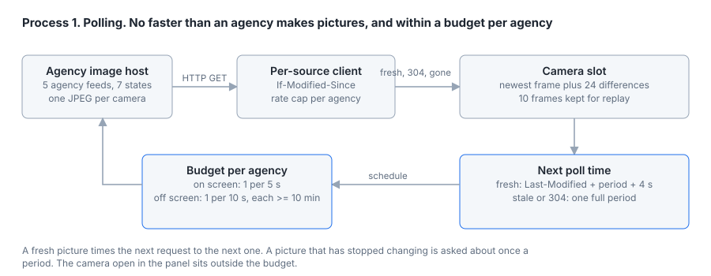
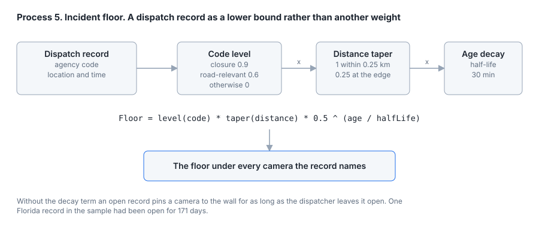
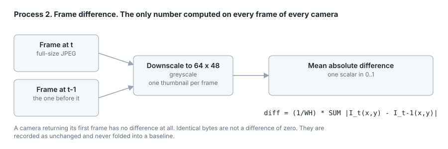
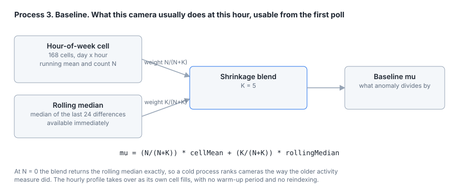
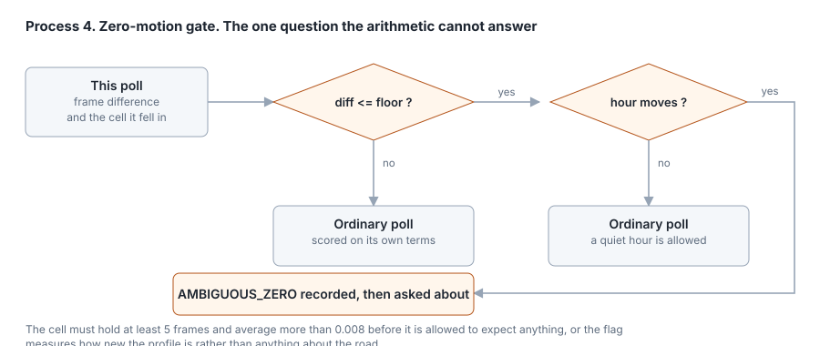
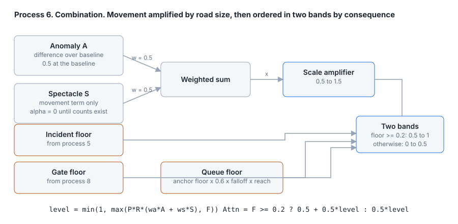
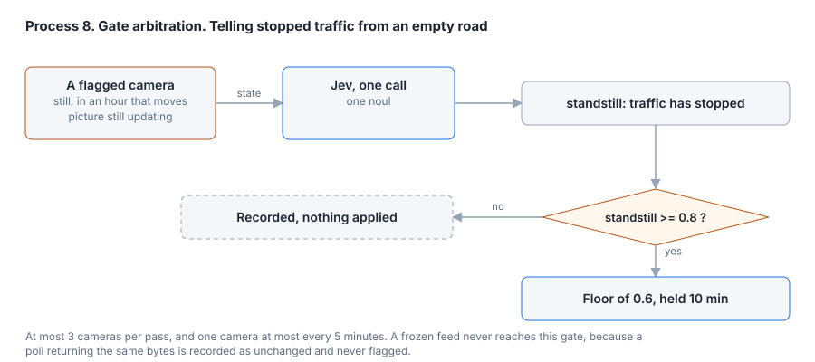
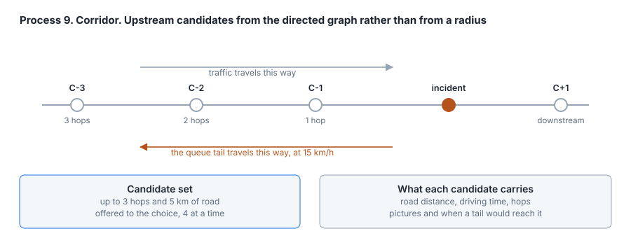
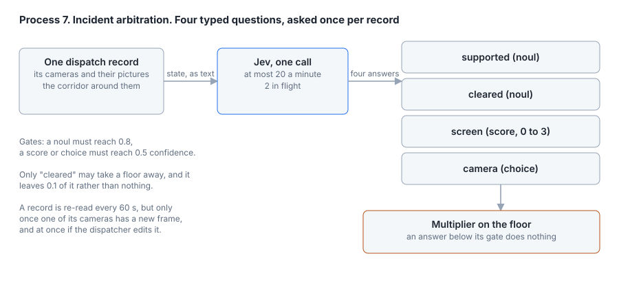
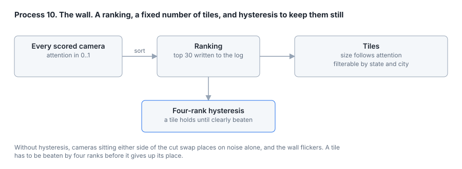

# rt511: Prioritizing Traffic Camera Feeds with Multi-Objective Visual Attention

*Technical whitepaper, architecture and implementation, September 2026*

## Executive summary

A traffic camera display has limited space, and deciding which feeds belong on it takes more than finding the pictures with the most movement. The rt511 pipeline weighs three considerations. The first is whether a scene is unusual for that camera at that hour. The second is whether it is visually engaging at all. The third is whether an incident makes it operationally important. The system calls these **anomaly**, **spectacle** and **consequence**.

The architecture separates continuous scoring from episodic reasoning. A fast path processes camera thumbnails, maintains activity baselines, and combines visual scores with priority floors raised by incidents and by queues inferred along the road graph. A separate reasoning layer, the Jev Arbiter, handles ambiguous low-motion states, upstream queue-tail selection and judgments of display prominence, and takes a second look at the leading cameras of each city a viewer has open.

The central design choice is to treat consequence as a floor rather than as another weighted visual signal. A feed therefore keeps its priority because of a reported incident even when its picture is still. The display allocator selects feeds from the resulting ranking, with hysteresis to limit needless turnover.

Two further parts turn the score into something a person can inspect and argue with. The first asks the viewer which of two cameras they would rather watch and fits a paired-comparison model to the answers, so a person's own attention can be set beside the equation's and the wall can be ranked by either. The second draws the scorer's graph reasoning on the city map as attention traveling along the roads from a camera that saw something to the cameras it made worth watching.

The fixed equation is kept as a baseline throughout. The arbiter's second look is treated as the method it would be compared against, and both are recorded side by side on every look, so that blind choices collected from a viewer can say which of the two agrees better with a person's attention. The machinery for that comparison is described here. The comparison itself has not been run.

> **Scope.** This document describes the running system. Every constant quoted below is read from the implementation, and the figures are generated from the same constants rather than drawn by hand, so a value in a figure and a value in the code cannot drift apart. Measured quantities are marked as measured and say what they were measured on. Several were taken on the vendor-platform regions the project used before 23 September 2026, when it moved to agencies' own published feeds, and they are labeled as such. Everything else is a design setting and not a benchmark result. This is a whitepaper and not a study, and it makes no claim that the system directs attention better than any alternative.

## 1. Background and theoretical grounding

The components of rt511 are engineering choices, and each has an established account behind it in the research literature. This section names that account for each component and says where the implementation follows it and where it only approximates it. None of these theories is tested here. The claim is a correspondence that makes each design choice open to inspection, and Section 10 lists what has and has not been measured.

**Allocating a limited display.** The overall problem is the one information foraging theory describes (Pirolli and Card, 1999). A viewer, or a wall acting for one, has more sources than it can attend to and must choose among them from cues available before consuming any. In that account the sources are patches and the cues are information scent. In rt511 each camera is a patch and each city a cluster of patches. The attention score plays the part of scent. The cities view ranks a city by its five strongest cameras, a patch-quality estimate that a single outlier cannot dominate.

**Keeping a tile.** Foraging theory also predicts when to leave a patch. The marginal value theorem holds that a forager should leave once a patch's rate of return falls below the average available elsewhere, net of the cost of moving (Charnov, 1976). The four-rank hysteresis is a crude form of that switching cost. A tile is surrendered only to a clearly better replacement, because every swap costs the viewer a reorientation.

**Anomaly as surprise.** The anomaly axis measures how far a camera departs from what it usually does at this hour of the week. This follows the account of attention as drawn by surprise, the departure of incoming data from an observer's expectation (Itti and Baldi, 2009). The implementation is a ratio of observed to expected frame difference. It keeps the direction of that account without the divergence between belief distributions that gives it a probabilistic form.

**Spectacle as bottom-up salience.** Spectacle stands for the pull of a busy scene whether or not it is unusual. Computational models of visual attention treat low-level features such as motion and contrast as salient before any judgment of relevance is made (Itti et al., 1998). rt511 uses a single such feature, temporal change, where those models combine many.

**Road size as exposure.** The scale prior uses annual average daily traffic, which traffic-safety analysis treats as exposure, the quantity against which event frequencies are normalized (AASHTO, 2010). A road carrying more vehicles offers more opportunity for events that matter. rt511 applies exposure only as a multiplicative weight on attention, which simplifies the role it plays in a rate model.

**Learning a baseline while operating.** The hour-of-week baseline is an empirical Bayes estimator. Each cell's mean is shrunk toward a pooled estimate in proportion to how little data the cell holds, the approach whose properties were established through the James-Stein estimator (Efron and Morris, 1973). Here the pooled value is the camera's own rolling median and the pseudo-count K is 5.

**Consequence as a constraint.** The incident floor turns consequence into a lower bound instead of a weight, so a high-consequence cue takes precedence over any amount of visual evidence against it. That is a lexicographic decision rule, in which one criterion is satisfied before the others are traded off (Fishburn, 1974). Its practical motive is that a stopped freeway and an empty one look identical to a pixel difference, so no weighting of visual evidence could protect the stopped one.

**Why stillness is ambiguous.** The fundamental diagram of traffic flow relates flow to density, and flow is zero both on an empty road and at jam density (Greenshields et al., 1935). Frame difference behaves like a flow measure, since it registers vehicles moving through the view, and so it inherits the same two zeros. The zero-motion gate exists because the ambiguity is structural and no choice of weights removes it.

**How a queue travels.** The queue floor follows kinematic wave theory, in which a change in density travels along a road as a wave whose speed follows from the fundamental diagram (Lighthill and Whitham, 1955), developed independently by Richards (1956). Behind a blockage that wave moves upstream, against the traffic. The floor is therefore carried only upstream, and only as far as the wave could have traveled since the report. The speed used, 15 km/h, sits at the slow end of the empirically reported range, as Section 4.2 notes.

**How an event spreads over the graph.** Carrying a floor from one camera to its neighbors is a form of spreading activation, in which activation at one node of a network passes to connected nodes and weakens with distance (Collins and Loftus, 1975). rt511 constrains that spread with traffic physics. It follows the direction of travel on each carriageway and weakens with road distance, and a camera is admitted only once the wave could have reached it. Section 8 draws that spread on the map.

**Record age and clearance.** The exponential decay of the incident floor amounts to assuming that an incident clears at a constant rate whatever its age. Hazard-based studies of incident duration generally find that assumption too simple, with the chance of clearance changing over the life of an incident (Nam and Mannering, 2000). The half-life is therefore a convenience, and a duration model fitted to dispatch records would be the principled replacement.

**Acting only when confident.** Jev's gates act on an answer only when its confidence clears a threshold, and otherwise leave the deterministic score in place. This is the reject option in classification, in which a classifier abstains below a confidence level and hands the decision to a fallback (Chow, 1970). The fallback here is the deterministic floor, so abstaining never removes a feed from the wall.

**A person's attention from comparisons.** People are poor at stating how much a camera deserves attention on an absolute scale and good at saying which of two they would rather watch. Paired comparison turns such choices into a scale. Thurstone's law of comparative judgment treats each choice as a noisy comparison of latent values (Thurstone, 1927), and the Bradley-Terry model gives the logistic form used here, in which the probability of preferring one item to another depends on the difference of their scores (Bradley and Terry, 1952). rt511 parameterizes each camera's score as a weighted sum of the same features the equation uses, so the fitted weights are directly comparable with the equation's structure. The pairs are chosen where the model is least certain, the uncertainty sampling strategy of active learning [REF: seminal uncertainty-sampling source, for example Lewis and Gale (1994), for choosing the next query where the current model is least sure].

## 2. Architecture and inputs

The pipeline has two processing paths with different responsibilities.

The **continuous fast path** maintains the attention ranking. It receives camera imagery and incident information, evaluates changes in the imagery against a baseline, and sends attention scores to the display allocator.

The **episodic reasoning layer** addresses questions that the continuous calculations do not resolve on their own. It receives ambiguous zero-motion states and corridor queries, and can return a confidence-gated adjustment to the scoring floor. Separating these responsibilities keeps the frame-level calculations distinct from the reasoning tasks.

The camera pool is drawn only from agencies whose written terms allow a third-party viewer to show their cameras, through the feeds they publish for the purpose. Five feeds cover seven states. They are Caltrans' commercial wholesale portal for California, the Iowa DOT open-data camera layer, Ohio's OHGO public API, Oregon's TripCheck API, and the New England Compass portal for Maine, New Hampshire and Vermont. Together they index 7,394 cameras, of which 29 metropolitan regions are built into road graphs. Kentucky was used until 28 September 2026 and was withdrawn because the host serving its pictures asks automated clients to stay away, which the project treats as the absence of permission. The feeds supply positions and image addresses, and every picture is reduced to a 64 × 48 grayscale thumbnail for visual processing. Pictures are held in memory only and are never written to disk. Ohio's incident API supplies the only dispatch-type feed in the current pool, and a scale prior based on published counts or road class supplies the remaining input.

The two main input branches remain distinct until scoring. Incident information feeds the floor evaluator. Camera imagery passes through inter-frame differencing, baseline profiling and the zero-motion gate. This arrangement lets the scorer consider visual activity without making incident priority depend on what is moving in the image.

Acquisition is scheduled off each response rather than off a clock, and within a budget for each agency. A response whose `Last-Modified` falls within the camera's refresh period says when the agency last made a picture, so the next request is timed to land 4 seconds after the next picture is due, one request per new picture. A `Last-Modified` older than a period says the camera is not updating on that schedule at the moment, and the image servers most agencies use keep an unchanged picture's time for minutes. Timing the next request to it would put that request in the past. An earlier version then fell back to a ten-second floor and asked about unchanged pictures six times a minute, which a live run measured at up to four times the intended rate. A stale time, a missing time and a "not modified" reply now all wait one full period. On top of that, each server asks each agency for at most one on-screen picture every 5 seconds and one off-screen picture every 10 seconds, however large the wall, and no off-screen camera more often than every ten minutes. A wall of forty cameras therefore refreshes each tile about every three minutes and a wall of ten every minute. Only the camera open in the panel sits outside the budget and keeps its agency's own rate. Section 9 gives the measured effect.



## 3. Continuous fast-path scoring

### 3.1 Establishing an incident priority floor

The incident floor evaluator assigns a minimum priority contribution that decays over time.

$$
F = F_0 \cdot \exp(-\lambda \Delta t)
$$

Here $F_0$ is the initial floor, $\lambda$ controls the rate of decay, and $\Delta t$ is the elapsed time since the record was reported. The implementation writes the same decay as a half-life of 30 minutes, which is the form the constant is stated in.

$F_0$ is the product of a record level and a distance taper. A record implying the road is closed is worth 0.9, a record about the road but not necessarily closing it is worth 0.6, and a record that is not about traffic is worth nothing at whatever distance. Every OHGO incident is a traffic event on a road, and ODOT marks a closed road in the record itself, so an Ohio record is worth 0.6 or 0.9. The taper is 1 within 250 m of the reported location and falls linearly to 0.25 at the 1.5 km linking radius, and no camera beyond that radius is linked to the record at all.

The floor carries incident-related consequence into the attention score independently of the visual components. Its role is to preserve an incident's importance when the visual evidence alone would produce a lower score, and it does not make an image appear more active.

A record needs a time to decay against. Dispatch feeds list records for as long as a dispatcher leaves them open, and a floor with nothing to decay against would hold a camera at the top of the wall indefinitely. On the state patrol dispatch feed used before 23 September, one record had been open for 171 days. OHGO publishes no report time, so an Ohio record is dated by when the server first saw it. The configuration has to ask for this explicitly, because it restarts the decay whenever the server restarts, and a feed configured without it gives an undated record no floor.



### 3.2 Measuring inter-frame change

The visual branch begins with the mean absolute difference between consecutive frames.

$$
\Delta I_t = \frac{1}{WH} \sum |I_t - I_{t-1}|
$$

In this expression $I_t$ and $I_{t-1}$ are consecutive thumbnails, and $W$ and $H$ are their width and height. The calculation summarizes how much the image has changed between the two frames. It is a change signal and makes no claim about incidents. The pipeline passes it to the baseline profiler so that the current observation can be considered against what the camera usually does.

Two cases are deliberately not differences of zero. A camera that has returned only one frame has no difference at all, and is scored as unknown rather than as still. A response carrying bytes identical to the previous one is recorded as unchanged and is never folded into a baseline, because the rolling median it would be blended with is taken over changed frames alone.



### 3.3 Building the activity baseline

The 168-hour shrinkage profiler blends an observed mean with a rolling baseline.

$$
\mu = \frac{N}{N+K}\bar{x} + \frac{K}{N+K}\mu_{\text{roll}}
$$

The expression combines the observed mean $\bar{x}$ for this camera's hour-of-week cell, supported by $N$ observations, with the rolling median $\mu_{\text{roll}}$ of its last 24 changed frames. The parameter $K$ controls how strongly the estimate relies on the rolling term and is set to 5. When $N = 0$ the estimate is entirely the rolling term, and as observations accumulate the observed mean receives more weight. The transition away from the fallback is gradual, and the system needs no calibration period before it can be used.

Each cell also keeps a running variance alongside its mean, which the decision log records. It does not enter the score. It is kept so that a calibrated threshold or a standardized deviation can replace the ratio once the log shows how the spread within a cell behaves.

The cold-start identity has been checked rather than assumed. Across 75 cells standing at $N = 0$ in a live run on the vendor-platform regions, the blended baseline produced a score identical to the older activity measure in every case. In the same run, 227 of 250 warm cells had already diverged from it, which is the profile beginning to carry information the rolling median does not.

**A warm-up cap.** A rolling median of three or four differences is itself noisy, and in the first minutes after a city opened most of its cameras scored 1.00, which said more about missing history than about the roads. The movement term is therefore capped while a camera's own history is short.

$$
A = \min\Big(\tfrac{1}{2} + \tfrac{1}{2}\min\big(1, \tfrac{n}{10}\big),\; \tfrac{1}{2}\,\frac{\Delta I}{\mu}\Big)
$$

Here $n$ is the number of frame differences the camera holds. With none, the cap is 0.5, the score of an ordinary picture, and it reaches 1 at ten differences, about ten minutes on screen. It is a cap and not a pull toward the middle, so a still picture reads 0 from the start and only saturation waits for evidence. The same cap is applied to the older activity measure, so the two still agree exactly before any hourly history exists.



### 3.4 Checking ambiguous zero-motion states

The zero-motion gate checks whether the current image change is small although the hour usually carries traffic.

$$
\Delta I \le \epsilon
\quad \text{and} \quad
\mu_{\text{cell}} \ge \tau
$$

The threshold $\epsilon$ defines the low-change condition and is set at 0.004, the noise floor the poller already uses to decide a camera has woken up. The activity level $\tau$ is set at twice that, 0.008.

Two details of the test matter. The comparison is against the cell's own mean rather than against the blended baseline, because the claim the flag makes is that this hour expects traffic, and a blend that is mostly the rolling median would let the flag fire about a camera nothing is yet known about. The cell must also hold at least 5 frames before it is allowed to expect anything. An earlier build without that guard fired on 34% of polls three minutes into a run, which measured how new the profile was and nothing about the road.

The pipeline labels this combination an **ambiguous zero state**. It is ambiguous in three ways. Traffic may have stopped, the road may be empty, or the feed may have frozen, and a mean absolute pixel difference is identical in all three. Section 4.1 describes how the state is resolved. Observations on the normal branch proceed to the attention scorer.



### 3.5 Supplying a scale prior

The scorer also receives a scale prior, $P_{\text{scale}}$, which expresses how much traffic a camera's road carries before anything moves in front of it. Where an agency publishes counts under terms that allow their use the prior is derived from them, and everywhere else it falls back to the road the camera was snapped to. In the current pool that means Iowa's published counts, joined to mainline segments on each camera's own route only.

The published counts are mapped logarithmically and then onto the unit interval.

$$
P_{\text{scale}} = \operatorname{clamp}\left( \frac{\log_{10}(1 + \text{AADT}) - \log_{10}(1 + 10^3)}{\log_{10}(1 + 2 \times 10^5) - \log_{10}(1 + 10^3)},\, 0,\, 1 \right)
$$

A logarithm is used because the counts span three orders of magnitude and the difference between 1,000 and 10,000 vehicles a day matters far more than the difference between 190,000 and 200,000. A thousand vehicles a day is a street nobody would watch and 200,000 is an urban interstate, so both ends of the scale are reachable.

Where no count is available but OpenStreetMap tags the road's lanes, the prior comes from a capacity proxy. The lanes carried in the camera's direction are multiplied by the posted speed and mapped logarithmically between a one-lane street at 40 km/h and a four-lane freeway direction at 110 km/h. A two-way road's tagged lanes are halved, and an untagged speed takes the class default. Where lanes are not tagged, the prior falls back to a road-class table running from 1.0 for a motorway down to 0.15 for a service road, with a ramp scored at 0.7 of the road it serves and an unplaced camera scored at 0.3. A lane count is never invented, so the order of preference is published counts, then the capacity proxy, then road class.

**How the prior enters the score.** The prior is applied as a single amplifier on the weighted sum of both visual axes.

$$
P = P_{\min} + (P_{\max} - P_{\min}) \cdot P_{\text{scale}}, \qquad P_{\min} = 0.5,\; P_{\max} = 1.5
$$

The amplifier multiplies the combined visual score rather than one axis, so the two axes remain separately readable in the log. Its lower bound is well above zero, so a residential street where something is plainly happening is damped rather than silenced. It also appears exactly once. An earlier arrangement multiplied the spectacle axis, which the weighted sum then applied at half weight, so its real effect was an amplifier over 0.5 to 1.0 that no constant in the code stated.

Before the capacity proxy, the class fallback barely discriminated on an all-freeway network. In Phoenix, a vendor-platform region, 76 of 80 cameras carried a prior of exactly 1.0 and the region resolved to three distinct values. With lanes and speeds the same cameras took nine distinct values, and 42 of 80 still reached the proxy's ceiling. The proxy tracks published volume only moderately. On 548 Florida cameras with both a count and tagged lanes, the Spearman rank correlation between the two priors was 0.48, so published counts remain the preferred source wherever an agency releases them under usable terms.

### 3.6 Combining anomaly, spectacle and consequence

The three-axis attention scorer uses the following rule.

$$
\text{Attn} = \operatorname{clamp}\Big(
\max\big(P \cdot (w_a A + w_s S),\; F_{\text{incident}},\; F_{\text{queue}},\; F_{\text{gate}}\big),\,
0,\, 1
\Big)
$$

The anomaly component $A$ and spectacle component $S$ form a weighted visual score with $w_a = w_s = 0.5$. Anomaly is the frame difference divided by the baseline, scaled so that a camera doing exactly what it usually does at this hour scores 0.5 and twice the baseline saturates, and capped as Section 3.3 describes. Spectacle is the movement term alone, currently equal to the relative term because the absolute weight $\alpha$ is held at zero. The system has no absolute measure of how many vehicles are in a frame, only a mean pixel difference, which varies with resolution, lens, weather and time of day and is not comparable between cameras. The term is wired so that a real volume measure can be weighed in by changing one constant.

The scorer compares the amplified visual sum with three floors and keeps the largest of the four, and the final clamp bounds the result between 0 and 1. Although the architecture describes three axes, their mathematical roles are not symmetric. Anomaly and spectacle are added together and then amplified, while consequence sets a lower bound. This lets incident information preserve a feed's priority without requiring a high visual score.

The three floors are kept apart rather than merged. The incident floor comes from an agency's record, the queue floor from the road network carrying that record upstream, and the gate floor from a picture. A log that cannot tell them apart cannot be used to calibrate any of them. The floor is a scoring constraint and reserves no display position, and selection still happens downstream in the display allocator.



## 4. Episodic reasoning with the Jev Arbiter

Jev is a typed reasoning engine that answers structured questions about text and graph state. Its role is separate from the image-differencing calculation, and its responsibilities are divided among three typed primitives. A Noul is a yes-or-no judgment with its own probability, a Score places an item on an ordinal rubric with a confidence, and a Choice selects one candidate from an explicit set with a confidence. Typed answers are what make the gates below possible, because an answer that is a number with a stated confidence can be thresholded and logged, and free prose cannot.

Two properties hold across every call. The arbiter modulates and never replaces, so the deterministic floor is computed first and stands on its own, and an answer moves it only within bounds the code sets. Every answer is also gated, so an unconfident answer changes nothing, and low confidence means the feed is treated normally and never hidden. Answers are model output about public data. They are treated as data and never as instructions, and so is everything in the state sent to the model, including any free text in an agency's record.

Jev runs only when a key is configured, and its internals are kept out of the interface. The viewer sees the floors and factors it adjusted as part of the score.

The first three uses below are about exceptions, a still picture and an incident record, and on the current pool they are rare. Section 4.4 describes the one use that takes part in ranking itself.

### 4.1 Noul, resolving an ambiguous zero state

**What the arbiter receives.** A flagged camera is described by its road and view, a summary phrase for what its picture is doing, its frame difference, the usual difference for this hour, the ratio between them, how many frames the hour-of-week cell holds, how long ago the newest frame arrived, the time of day in words, whether an agency record already names it and, when a vehicle detector is running, how many vehicles it counted in the picture. Alongside it comes the corridor, as up to four neighboring cameras with their side, road distance and hop count. The corridor is the evidence that separates the answers. Stillness at a camera while the approach is also slowing is a queue, and the same stillness with the approach running normally is not.

**What is asked.** Two Nouls are asked, because the state is three-way. The first asks whether the stillness is stopped traffic rather than an empty road. The second asks whether the feed has stopped updating. They are not mutually exclusive and are not asked to be. Ranking them against each other would be recombination, and recombination belongs in code with weights that can be read.

**What is done with the answers.** A Noul's own probability is the gate, set at 0.8. A confident frozen answer takes precedence and suppresses the standstill answer with it, because a picture that is not arriving is not evidence about the road. Otherwise a confident standstill answer applies a floor override.

$$
F_{\text{gate}} = \tau_{\text{gridlock}} = 0.6
$$

This is the level a road-relevant record receives, because a confirmed standstill is an incident nobody has reported yet. The floor is held for 10 minutes and then expires, so a standstill that has drained becomes an ordinary camera again. Anything below the threshold is recorded in the axes and the log and changes no score.

**What it costs.** At most 3 cameras are asked about per ranking pass, and no camera is asked about more than once in 5 minutes. The concurrency cap of 2 calls in flight usually binds first within a single pass. These limits turn a region-wide feed fault into a handful of calls rather than one per camera. The re-ask window is shorter than the 10-minute hold on purpose, so a standstill that is still standing can renew its floor before the floor expires.



### 4.2 Choice, selecting an upstream queue tail

**The candidate set** is the directed upstream neighborhood of the cameras a record names. Starting from each named camera's site, the walk follows corridor edges backwards against the direction of travel for up to 3 hops and up to 5,000 m of accumulated road distance. Both bounds are needed. Hop count alone reached 18.7 km through a ramp-dense interchange on the Miami graph, and a queue standing that far back would have taken more than an hour to arrive, by which time the incident floor that raised the query has decayed through two half-lives. Five kilometers is about twenty minutes at the stopping-wave speed, which is the window the floor actually survives.

**What each candidate carries** is its road and view, which side of the incident it sits on, the road distance and driving time to it, the number of hops, and the time a queue tail would take to reach it.

$$
\tau_{ij} = \frac{\Delta M_{ij}}{v_{\text{wave}}}, \qquad v_{\text{wave}} = 15 \text{ km/h}
$$

The stopping wave travels backwards against the traffic, so the quantity is computed for upstream candidates only and left empty elsewhere. The speed is a design setting in this system and has not been measured on these corridors. Empirical studies place the speed at which congestion propagates against the traffic between 15 and 20 km/h, varying with country and traffic composition (Treiber et al., 2010). The 15 km/h used here sits at the slow end of that range, which delays the arrival of an inferred queue rather than hastening it.

**The queue floor.** The graph also acts without Jev. When a record puts a floor under a camera, every camera upstream of it on the same carriageway, within the walk's bounds, receives a smaller floor of its own. A stopped-traffic verdict from the gate is carried the same way, with its age measured from when Jev confirmed it.

$$
F_{\text{queue}} = F_{\text{anchor}} \cdot s \cdot \Big(1 - \frac{\Delta M}{M_{\max}}\Big) \cdot \min\Big(1, \frac{\Delta t}{\tau}\Big), \qquad s = 0.6,\; M_{\max} = 5{,}000 \text{ m}
$$

Here $F_{\text{anchor}}$ is the deterministic floor the record gives the camera it names, before any Jev adjustment. $\Delta M$ is the road distance upstream, $\Delta t$ is the record's age and $\tau$ is the stopping-wave arrival time above. The share $s$ is below one because an upstream camera is inferred and not seen. The last term ramps the floor in as a queue could plausibly have reached the camera. It is a ramp because the wave speed it depends on is a design setting, and a hard cutoff on it would claim a precision the setting does not have. Because $F_{\text{anchor}}$ carries the record's half-life, the queue floor rises and then decays. Cameras the record names keep their own incident floor and receive no queue floor from it, and downstream and off-corridor cameras receive nothing.

As a worked example computed from the formula, a fresh closure reported beside one camera gives a camera 1.7 km upstream a queue floor of about 0.30 when the tail could first reach it, about seven minutes in, falling to about 0.09 an hour later. On the state patrol feed used before 23 September, on the night of 20 September, 18 cameras across four cities carried an incident floor and 31 upstream cameras carried a queue floor, but none above 0.03, because every record then open was more than an hour old.

**The downstream connection.** When the Choice picks a camera the record named, that camera's floor is multiplied by 1.25 while the record's other cameras keep 0.75 of theirs, and only when the choice carries at least 0.5 confidence. When it confidently picks an upstream camera the record did not name, that camera receives a queue floor equal to the record's highest floor multiplied by what the verdict would give a named and chosen camera, and the named cameras keep their floors undiminished. The choice then adds a view of the event and takes none away. Upstream candidates are described to Jev with their pictures, as the named cameras are. In the first 68 live reviews they were described without them and were never once chosen, which is what exposed the gap.

Measured on the vendor-platform graphs, the bounded walk reached an upstream site from 74 of 77 Miami sites, 258 of 262 Tallahassee sites and 46 of 47 Madison sites. The median distance to the nearest upstream site was 1,106 m in Miami, 462 m in Tallahassee and 1,611 m in Madison, which at the stopping-wave speed correspond to tail arrival times of roughly four, two and six minutes.



### 4.3 Score, assigning display prominence

The Score primitive applies an ordinal prominence rubric with four levels, from a record not worth showing at all up to one worth the main panel. Its purpose is to let major closures preempt ambient feeds. This rubric is distinct from the continuous attention score. The attention score is bounded between 0 and 1 and takes part in ranking, while the rubric expresses an ordinal judgment that is mapped to a multiplier on the floor and never to a display position.

All four incident questions travel in one call, because they are evaluated independently and in parallel, so asking four costs barely more than asking one. The mapping from answers to a multiplier is as follows.

| Answer | Gate | Effect when the gate is met |
| --- | --- | --- |
| cleared (noul) | 0.8 | multiplies the floor by 0.1 |
| screen (score, 0 to 3) | 0.5 confidence | multiplies by $1 + 0.5(2n - 1)$ for normalized level $n$ |
| supported (noul) | 0.8 | multiplies by 1.2 |
| camera (choice) | 0.5 confidence | 1.25 for the chosen camera, 0.75 for the others |

Only the cleared answer can collapse a floor, and it leaves a tenth of it because the record is still open. The other answers work in both directions. A confident screen score at the bottom of the rubric halves the floor, and the cameras Jev did not choose keep three quarters of theirs. Supported is the only answer that can only lift.

**How often a record is re-read.** The arbiter re-reads a record whenever two conditions hold together. At least 60 seconds must have passed since its last answer, and at least one of its cameras must have returned a new frame since then. The window says how soon an answer may be replaced, and the evidence check says whether replacing it could produce anything different, so a record whose cameras have all gone quiet keeps its answer until one of them changes. This makes the arbitration follow the polling budget without a separate schedule. An edited record is exempt from the window, because the fingerprint that identifies it will not match.



**One measured failure, recorded because it shaped the design.** With the picture guard bypassed, eight live records were scored on the screen rubric while every camera they named read "no picture yet". All eight returned between 0.3 and 1.1 of 3 whatever their dispatch code said, including two open roadblocks. The rubric's upper levels ask for a camera showing something, so absence of evidence was read as absence of severity. The guard that now prevents this refuses to ask about a record until at least one of its cameras has returned a difference. A floor must not be lowered because of a gap in the system's own coverage.

### 4.4 Score, a second look at the top of a city

The equation scores each camera from its own numbers, but whether a camera deserves attention is relative. A busy interstate at rush hour is less remarkable beside five others doing the same thing. The review asks Jev for that relative judgment. While a viewer has a city open, its eight leading cameras with a recent picture are described together in one state, and one Score per camera asks how much that camera deserves the attention of a person watching the city, compared with the others listed. The rubric runs from nothing to watch, through worth a glance and worth watching, to the one to watch first.

Each camera is described by the evidence the equation used, namely its road and view, whether it is on a freeway, how much traffic its road carries, its picture against the usual for the hour, how many frames stand behind that hour, how recent its picture is, and any incident, expected queue or confirmed standstill on it. The equation's own score is left out, so the answer is a second opinion and not an echo of the first.

A confident answer, at a confidence of at least 0.5, multiplies the camera's movement term by a factor between 0.75 at the bottom of the rubric and 1.25 at the top.

$$
\text{Attn} = \operatorname{clamp}\Big(
\max\big(P \cdot R \cdot (w_a A + w_s S),\; F_{\text{incident}},\; F_{\text{queue}},\; F_{\text{gate}}\big),\,
0,\, 1
\Big), \qquad R = 1 + 0.25\,(2n - 1)
$$

Here $n$ is the camera's level normalized to the unit interval, and $R$ is one for any camera without a confident answer. The factor touches only the movement term. It can reorder cameras the equation scores close together, and it cannot lift a still picture over a busy one or lower a floor, so an incident or a stopped queue keeps exactly the priority it earned. A factor is held for ten minutes and then lapses, so a camera that has left the leaders is judged by the equation alone again.

A city is looked at again no sooner than every two minutes, and only once one of its leaders has returned a new picture, which keeps the review on the same evidence-driven cadence as the incident questions. One open city therefore costs at most thirty calls an hour, inside the arbiter's shared limits. A live call on four synthetic cameras took 356 ms and about 1,900 input tokens. It placed the camera moving three times its usual at 2.66 of 3, an ordinary one at 0.15, and one carrying a reported crash at 2.17. How either ranking compares with a person's own choices from Section 7 has not been measured yet, and Section 7.5 describes how that comparison is set up.

The first live looks, on the Des Moines wall on 28 September 2026, showed how far apart the two rankings are. Over four looks at eight leading cameras in seven minutes, the Kendall tau between the equation's order and the look's was 0.29, 0.00, −0.14 and 0.07, and the two never put the same camera first. The look was also decisive, often placing a camera the equation ranked near the top at a level below 0.2 with a confidence above 0.85. Each look used about 3,800 input tokens and answered in 226 to 482 ms. Four looks say only that the two rankings differ. Which of them is closer to a person's attention is the open question that Section 7.5 is set up to answer.

### 4.5 Why a typed model, and what it cannot do

The arbiter was chosen for the shape of its answers rather than for any measured quality of its judgment. Each question returns a number, a probability for a Noul and a level with a confidence for a Score or a Choice, so every answer can be compared with a threshold, bounded and written to the log without parsing text. Several questions travel in one call and are answered independently, so the model is never asked to weigh its own answers against each other. That recombination stays in the code, with weights that can be read. A response that lacks any question it was asked is treated as a failure, and the deterministic score stands. Live calls took between 226 and 482 ms and used between about 1,900 and 3,800 input tokens.

The same design has limits that follow from the model. It accepts text only and cannot look at a camera. What it reasons over is the description the system builds, so it knows that a picture changed three times as much as usual for the hour and not what the picture shows. The model is proprietary and paid for, it cannot run locally, and it is addressed by its latest version, so its answers can change without any change here. Every log line records the model version that answered and the rubric version it answered, which is what keeps answers from different versions apart. The confidence it reports is described as calibrated in its documentation [REF: TypeSafe System One documentation on calibration of Noul probabilities and Score and Choice confidences], and that calibration has not been checked on this task.

No other model has been compared with it here. The alternative considered at the outset was an open model run locally, with its output constrained to a fixed structure and its token probabilities read as confidence [REF: grammar-constrained decoding for structured LLM output, and calibration of token probabilities as confidence]. That would cost nothing to run and could include a vision model that sees the frame itself. It would also leave the calibration of its confidence to be built and verified within this project. Such a model could be added as a further ranking beside the equation and the second look, and the evaluation of Section 7.5 would compare all of them on the same blind choices.

## 5. The corridor graph

### 5.1 Nodes and edges

The graph is built per region by an offline pipeline from OpenStreetMap road geometry and loaded at startup. Its vertices are **sites** and not cameras. A site is a place on the road network, and it holds the one or more cameras that look at that place. The separation matters because several cameras routinely share a location, and because a camera with no published direction at a divided highway is represented by a pair of sites, one per carriageway, rather than by a single ambiguous point. Iowa publishes no direction for its cameras, so this case is common in the current pool. Each site carries the snapped road it sits on, including its route references and road class, which is also what the scale-prior fallback reads.

Edges are directed and typed. A freeway, ramp or street edge runs in the direction of travel and carries a length in meters and a free-flow travel time in seconds. An edge arriving at a site comes from where traffic approaching that site comes from, which is the definition the upstream walk depends on. A `nearby` edge is undirected and means only that two sites are close without a road between them, so it carries no side and is never walked through. The Miami region, with 77 sites and 254 edges, of which 41 were freeway, 165 ramp, 47 street and 1 nearby, was representative of the vendor-platform graphs in shape.

### 5.2 Why topology rather than a radius

Upstream and downstream queries follow directed edges rather than a Euclidean neighborhood. Two cameras 400 m apart in a straight line may be on opposite carriageways of a divided highway, on a frontage road or on a crossing street. None of those is a place where a queue behind a blockage will appear, and a radius cannot tell any of them from the camera half a mile back on the same pavement, which is. Road distance is also what the shockwave arrival time must be computed from for the number to mean anything.

### 5.3 How cameras reach the graph

Cameras are placed on the network by a snapping step that scores candidate roads by route-reference tokens and by direction, with the direction penalty graded by angle. Posted route directions are not compass bearings, and treating them as such produced 13 mismatches in Buffalo alone, where Interstate 190 is signed north where the pavement runs west. Only a disagreement greater than 135 degrees is treated as a reversal. Cameras whose names contain an intersection marker forfeit their route references and are kept off the mainline, because a camera named for a freeway at a cross street is usually a ramp-terminal view. Four cameras in Tallahassee named "I-10 South" were placed on the freeway before this rule existed.

### 5.4 How an event reaches its neighbors

The graph also decides what the server looks at closely. The trigger is direct evidence at one camera, which means an incident floor, a confirmed standstill, or movement at least 1.8 times the camera's usual level for the hour once its hour-of-week profile holds five frames. Every camera within two hops of a triggering camera is then fetched with the cameras on screen for the next five minutes, ahead of the rest of the city, and shares their budget. Upstream neighbors are taken first, because a queue grows toward them, then downstream ones, because a moving disturbance travels that way, then the opposite carriageway at an interchange. A queue floor does not trigger promotion. It is itself inferred from the graph, and letting it trigger would cascade promotions along the corridor.

At most thirty cameras are promoted at once. Candidates are ordered by hop count before anything else, so every triggering camera has its adjacent cameras promoted before any trigger's second hop. Ordered by trigger strength alone, the two strongest triggers on the dispatch feed then in use took all thirty places between them and left every other event with nothing looked at.

Only confirmed events propagate as score. Raw movement travels only as attention to look, because carrying it as score would let a headlight flare or a rain squall at one camera raise every camera downstream of it.

## 6. Display allocation and decision logging

The display allocator ranks feeds by the attention score and cuts them into tile sizes by rank position. Four-rank hysteresis keeps small ranking changes from changing the displayed set, since without it cameras either side of a cut swap places on noise alone. Each tile shows its score and the term that drove it, a line that fills until the camera's next picture is due, and whether the agency publishes live video for it or only snapshots, so a wall of stills refreshed minutes apart still shows it is working.

**The national board.** A board of the thirty highest-scoring cameras across the country needs scores in every city, but a city is polled only while someone has it open. A low-rate radar closes that gap. In each city nobody is watching, ten cameras are sampled once every ten minutes, chosen by road size and rotated hourly so that a quiet city is sampled across its network over a day. That is about 0.017 requests a second per city, half a request a second across thirty. When a sampled camera passes the trigger of Section 5.4, its neighbors are promoted as they would be in an open city. The board leaves off any camera whose newest picture is more than twenty minutes old, two radar periods, so a score from a city that has been closed never ranks against live ones.

The allocator ranked on raw frame-difference activity until the attention score replaced it. Measured on a live region at the moment of the change, 41 of 57 scored cameras would move rank under the attention score and 12 would move by four ranks or more. Agreement at the very top was higher, 11 of the leading 12, because ten of those cameras were saturated at the top of both scales, which makes their order arbitrary in either scheme.

The decision logger writes one line per camera in the top 30, no more often than every 10 seconds, rotated daily and capped in size.

```text
ts, id, region, rank, attention, activity, diff,
anomaly, spectacle, baseline, baseline_n,
scale_prior, scale_prior_source, scale_amplifier, aadt, highway,
incident_floor, incident_floor_base, incident, jev,
ambiguous_zero, gate, review
```

Keeping the components separate is what makes the log usable for calibration. `incident_floor_base` is the floor before the arbiter touched it and `incident_floor` is the floor after, so the effect of every answer can be recovered from the log alone. The arbiter writes its own log in parallel, one line per call, with the full state sent, the answers returned, the latency and the token usage, and with the rubrics written at the top of each day's file so that an answer can always be read against the question that produced it. The rubric version is recorded on every line and is incremented by hand whenever a rubric or the state feeding it changes, because answers under different versions are not comparable.



## 7. A person's attention

The equation encodes one view of what deserves attention. The second half of the idea is to ask a person, and to compare the two.

### 7.1 The comparison

In any open city the viewer can ask to be shown two of its cameras side by side. Only the pictures and the camera names are shown, so the choice is made without the scores. The viewer picks the camera they would rather watch or skips the pair. After the choice, both of the equation's scores are revealed with whether the equation would have chosen the same, and the next pair follows.

### 7.2 The model

Each choice is a comparison between two feature vectors $x_a$ and $x_b$. The features are the eight quantities the equation already reports or the viewer can see, namely unusual movement, the scale prior, the incident floor, the queue floor, the stopped-traffic floor, a darkness term that ramps from 0 with the sun six degrees above the horizon to 1 six degrees below it, the picture's mean brightness, and whether the camera is on a freeway. Each is roughly on the unit interval, so the weights are comparable with one another. The Bradley-Terry model gives the probability of choosing $a$.

$$
P(a \succ b) = \sigma\big(w^\top (x_a - x_b)\big)
$$

There is no intercept, so swapping the two cameras swaps the answer. The weights are fitted by full-batch gradient descent on the logistic loss with a small L2 penalty, from zero, for a fixed 400 steps, which gives the same weights for the same choices. A person's own score for a camera is $w^\top x$, and only its order is used.

### 7.3 Choosing the next pair

For the first five choices the pair is drawn at random. After that, thirty random pairs are drawn and the one whose predicted probability is closest to one half is shown, so each answer falls where the current model is least sure. Cameras shown in the last six pairs are rested when the pool allows it. Pairs are drawn only from cameras with a score and a picture newer than three of their refresh periods.

### 7.4 Agreement and ranking by the person

Two summaries set the person beside the equation. Agreement is the share of choices, among pairs the equation scored differently, in which the equation's higher-scored camera was the one chosen. The widest disagreements are the choices of the camera the equation scored lower, ordered by the gap. After ten choices the wall can be ranked by the person's score instead of the equation's, through the same allocator and hysteresis, while each tile keeps showing the equation's own number so the two can be read against each other.

### 7.5 Evaluating the rankers

The same comparison serves as the reference for judging rankings, with the fixed equation as the baseline and the second look of Section 4.4 as the method under test. Two changes make that fair. The equation's own score is kept on every camera beside the score the wall uses, so the baseline is unaffected by the look. And an Evaluate mode draws its pairs without reference to the person's own model, half uniformly and half from pairs the equation and the look order in opposite directions by more than a near tie, and reveals no score after a choice, so nothing learned from one answer steers the next. Every look is also recorded in full, both orderings of the same cameras and the look's levels whether or not they were confident enough to act on, so it is evaluated as a ranking in its own right rather than through the bounded factor the wall applies.

Each ranker is then scored as the share of blind choices where it favored the camera the person picked, with a bootstrap interval. Every ranker is scored on the same choices, those where both the equation and the look told the two cameras apart, and a look's levels are only compared with levels from the same look, since the rubric places each camera relative to the others judged with it. Results are reported separately for the uniform stratum, which gives an overall figure, and the disagreement stratum, which says which ranking is right when they differ. The person's own model is scored on held-out choices only. No results are reported here yet, and one person's choices describe one person's attention. A claim about attention in general needs several people and their agreement with each other.

### 7.6 What this is and is not

The choices stay in the viewer's browser and are never sent anywhere, and they can be exported for analysis. The model is one person's, fitted on at most a few thousand comparisons. It is a way to state that person's attention in the equation's terms and see where the two part ways. It is not a dataset of human attention and has not been compared with any. Whether a small linear model over these features captures what a person means by worth watching is itself an open question, and the fitted weights of a person who chooses on something outside the features, such as a scenic view, will spread across whatever features correlate with it.

## 8. Attention made visible

Most of what the scorer decides about the graph is invisible on a wall of pictures. The city map draws two kinds of spreading. A promotion, from Section 5.4, is drawn from the triggering camera to each camera it made worth watching. A queue floor, from Section 4.2, is drawn from the camera the record or verdict anchors to each upstream camera it reached. Each is drawn along the road between the two sites, found by a breadth-first walk over the graph's links in either direction and limited to eight hops, and a pair not joined by road within that limit is not drawn rather than drawn as a straight line. Pulses travel at a steady speed on screen from the source to the receiving camera, so a longer road takes longer to cross, and a ring opens where they land. The color gives the reason, one for movement, one for stopped traffic and one for an incident.

Nothing is decided for this display. It shows the promotions the server has already made and the queue floors already in the scores, read every ten seconds while the map is open. The pulses are drawn on a separate layer above the map, so a frame costs a few dozen points rather than a redraw of every road, and the drawing stops whenever there is nothing to show or the map is off screen. With thirty flows on a live map the display held sixty frames a second.

## 9. Cost to the agencies

A viewer built on agencies' cameras has to be a light guest, because each person running it adds to what the agencies serve. The design target is that one viewer costs an agency about what one person watching the agency's own 511 site does. Live video is never touched by the server. The browser plays the agency's own stream directly, exactly as the agency's site does, and only while that camera is open. Snapshots are fetched within the budget of Section 2, every request is conditional so an unchanged picture costs a reply with no body, and a browser tab nobody can see asks for nothing.

The effect was measured on the same Des Moines wall with one viewer at the same window size, before and after the scheduling fix and the budget. Before, the server made about 2.4 requests a second to Iowa DOT and received about 1.7 GB an hour. After, it made about 0.4 requests a second on average and received about 290 MB an hour. The first minute after a city opens is still heavy, about two requests a second, because every tile needs its first picture, and tiles fetched together at the start then refresh together in waves about three minutes apart. Picture sizes differ widely between agencies, from about 30 KB in Oregon to about 200 KB in Iowa, so the same budget costs very different bandwidth by state.

## 10. Settings, what has been measured, and what remains open

### 10.1 Design settings

| Element | Setting |
| --- | --- |
| Sources | 5 agency feeds, 7 states, 7,394 cameras indexed, 29 built regions |
| Visual-processing thumbnails | 64 × 48 pixels |
| Poll timing | 4 s after the next expected picture when Last-Modified is within a period, otherwise one full period |
| Request budget per agency | 1 on-screen picture per 5 s, 1 off-screen picture per 10 s |
| Off-screen camera period | at least 10 minutes |
| Camera open in the panel | agency's own rate, 5 s for Ohio, outside the budget |
| Rolling window | 24 changed frames |
| Baseline profiler | 168 hour-of-week cells |
| Shrinkage parameter | $K = 5$ |
| Anomaly at baseline | 0.5 |
| Warm-up cap | 0.5 with no history, 1 at 10 differences |
| Axis weights | $w_a = w_s = 0.5$ |
| Absolute spectacle weight | $\alpha = 0$ |
| Scale amplifier range | 0.5 to 1.5 |
| Zero-motion thresholds | $\epsilon = 0.004$, $\tau = 0.008$, at least 5 frames in the cell |
| Incident floor levels | 0.9 closure, 0.6 road-relevant, 0 otherwise |
| Incident half-life | 30 minutes |
| Incident linking radius | 1.5 km, at most 6 cameras per record |
| Gridlock floor | 0.6, held for 10 minutes |
| Incident re-read window | 60 s, and only on a new frame |
| Gate re-read window | 5 minutes |
| Noul gate | 0.8 |
| Score and Choice confidence gate | 0.5 |
| Upstream walk | 3 hops, 5,000 m |
| Upstream queue share | 0.6 of the anchor's floor, falling to zero at 5,000 m |
| Capacity prior range | 1 lane at 40 km/h to 4 lanes at 110 km/h, per direction |
| Neighbor promotion | 2 hops, at most 30 cameras, held 5 minutes, within the on-screen budget |
| National radar | 10 cameras per unwatched city every 10 minutes, rotated hourly |
| Board freshness | newest picture within 20 minutes |
| Stopping-wave speed | 15 km/h |
| Arbiter rate limits | 20 calls per minute, 2 in flight, 3 gate calls per pass |
| Review of a city's leaders | 8 cameras, at most every 2 minutes and only on a new picture, factor 0.75 to 1.25 on movement at confidence 0.5, held 10 minutes |
| Display selection | top 30 feeds |
| Display hysteresis | four ranks |
| Comparison model | Bradley-Terry over 8 features, L2 0.02, 400 steps from zero |
| Comparison pair selection | random for 5 choices, then least certain of 30 random pairs |
| Ranking by a person | after 10 choices |
| Evaluation pairs | half uniform, half from pairs the equation and the look order oppositely by more than 0.02 and 0.25, nothing revealed after a choice |
| Attention spreading drawn | road paths up to 8 hops, refreshed every 10 s |

These values describe the configuration as it runs. They do not establish ranking accuracy, latency, deployment coverage or operator benefit.

### 10.2 What has been measured

| Quantity | Measurement | Where |
| --- | --- | --- |
| Cold-start agreement with the older activity measure | 75 of 75 cells at $N = 0$ identical, 0 mismatches | live run, vendor-platform regions |
| Warm cells diverging from the rolling median | 227 of 250 | same run |
| Zero-motion gate trigger rate | 0 of 2,831 polls | Miami, daytime, vendor platform |
| Upstream reachability within the walk bounds | 74 of 77, 258 of 262, 46 of 47 sites | Miami, Tallahassee, Madison, vendor platform |
| Median distance to the nearest upstream site | 1,106 m, 462 m, 1,611 m | same regions |
| Scale prior distinctness on an all-freeway network | 3 distinct values and 76 of 80 at 1.0 by road class, 9 and 42 of 80 with lanes and speed | Phoenix, vendor platform |
| Capacity proxy against published counts | Spearman 0.48, n = 548 | Florida, vendor platform |
| Arbiter call cost | 2,645 input and 210 output tokens, 408 ms | one live incident record |
| Request rate and bandwidth, one viewer on a city wall | 2.4 to 0.4 requests a second, 1.7 GB to 290 MB an hour | Des Moines, 28 September 2026 |
| Request rate before the scheduling fix, against its design | up to 4 times the intended rate | Des Moines and Columbus |
| National radar request rate | 0.47 requests a second with 318 sampled cameras | 32 regions before Kentucky left, none open |
| Attention spreading display | 60 frames a second with 30 flows drawn | Des Moines map |
| Second look against the equation | Kendall tau 0.29, 0.00, −0.14 and 0.07 over four looks, never the same camera first, about 3,800 input tokens a look | Des Moines, 28 September 2026 |

The zero-motion result is the one to read carefully. A trigger rate of zero over 2,831 daytime polls says the gate is quiet and not that it is correct, and the sample contains no night hours and no jam conditions. The gate's value so far is that it makes the ambiguous case explicit and cheap to count.

### 10.3 What remains open

Most of what is open needs measurement rather than design. An absolute measure of vehicle presence is not part of the score. The spectacle axis is wired for one and carries none, and the optional vehicle detector, which supplies counts to the gate as evidence, has not been validated as that measure. The ambiguous-zero rate has not been observed at night or under congestion, which is where the gate is supposed to matter. The stopping-wave speed comes from the slow end of a published empirical range and has not been measured on these corridors. The capacity proxy tracks published counts only moderately, and only Iowa's counts are usable in the current pool. Incident coverage exists for one state of seven. None of the arbiter's rubrics has been calibrated against labeled outcomes, which is what the decision log exists to make possible and what the rubric version exists to keep comparable. Nothing has yet been measured about how people choose between cameras. The comparison model gives a way to collect that for one person at a time, and whether the equation's structure matches any person's attention, or whether different people agree with each other, is untested. The same holds for the second look. Its rankings differ sharply from the equation's, and whether either one is closer to a person's choices waits on blind choices collected in Evaluate mode. The look also depends on a proprietary model addressed by its latest version, so any figure reported from it has to name the model version and rubric version it came from.

## Conclusion

rt511 treats camera selection as more than a search for visual activity. It combines anomaly and spectacle, amplified by how much traffic a road carries, with separate consequence floors, and it uses episodic reasoning for ambiguous states and network-level questions. Its clearest design commitment is that incident importance should not disappear because the associated picture receives a low visual score.

The system now also makes its reasoning open to a person in two ways. The spread of attention along the road graph is drawn as it happens, and a person's own choices between cameras are fitted in the equation's own terms, so the two can be compared directly. The fixed equation is kept as a baseline beside the arbiter's second look, and both are recorded on every look, so that blind choices can later say which is closer to a person's attention. The decision logs, the shadow record and the comparison export are structured so that each judgment can be taken apart afterwards. Evidence of effectiveness still requires an evaluation this document does not contain. What it contains is a specification precise enough that such an evaluation can be designed against it, and the means for the person using the system to begin it on their own attention.

## References

AASHTO (2010). *Highway Safety Manual*, 1st ed. American Association of State Highway and Transportation Officials, Washington, DC.

Bradley, R. A., & Terry, M. E. (1952). Rank analysis of incomplete block designs. I. The method of paired comparisons. *Biometrika*, 39(3/4), 324–345.

Charnov, E. L. (1976). Optimal foraging, the marginal value theorem. *Theoretical Population Biology*, 9(2), 129–136. https://doi.org/10.1016/0040-5809(76)90040-X

Chow, C. K. (1970). On optimum recognition error and reject tradeoff. *IEEE Transactions on Information Theory*, 16(1), 41–46. https://doi.org/10.1109/TIT.1970.1054406

Collins, A. M., & Loftus, E. F. (1975). A spreading-activation theory of semantic processing. *Psychological Review*, 82(6), 407–428. https://doi.org/10.1037/0033-295X.82.6.407

Efron, B., & Morris, C. (1973). Stein's estimation rule and its competitors, an empirical Bayes approach. *Journal of the American Statistical Association*, 68(341), 117–130. https://doi.org/10.2307/2284155

Fishburn, P. C. (1974). Lexicographic orders, utilities and decision rules: A survey. *Management Science*, 20(11), 1442–1471. https://doi.org/10.1287/mnsc.20.11.1442

Greenshields, B. D., Bibbins, J. R., Channing, W. S., & Miller, H. H. (1935). A study of traffic capacity. *Highway Research Board Proceedings*, 14, 448–477.

Itti, L., & Baldi, P. (2009). Bayesian surprise attracts human attention. *Vision Research*, 49(10), 1295–1306. https://doi.org/10.1016/j.visres.2008.09.007

Itti, L., Koch, C., & Niebur, E. (1998). A model of saliency-based visual attention for rapid scene analysis. *IEEE Transactions on Pattern Analysis and Machine Intelligence*, 20(11), 1254–1259. https://doi.org/10.1109/34.730558

Lighthill, M. J., & Whitham, G. B. (1955). On kinematic waves II. A theory of traffic flow on long crowded roads. *Proceedings of the Royal Society of London. Series A*, 229(1178), 317–345. https://doi.org/10.1098/rspa.1955.0089

Nam, D., & Mannering, F. (2000). An exploratory hazard-based analysis of highway incident duration. *Transportation Research Part A*, 34(2), 85–102. https://doi.org/10.1016/S0965-8564(98)00065-2

Pirolli, P., & Card, S. (1999). Information foraging. *Psychological Review*, 106(4), 643–675. https://doi.org/10.1037/0033-295X.106.4.643

Richards, P. I. (1956). Shock waves on the highway. *Operations Research*, 4(1), 42–51. https://doi.org/10.1287/opre.4.1.42

Thurstone, L. L. (1927). A law of comparative judgment. *Psychological Review*, 34(4), 273–286.

Treiber, M., Kesting, A., & Helbing, D. (2010). Three-phase traffic theory and two-phase models with a fundamental diagram in the light of empirical stylized facts. *Transportation Research Part B*, 44(8–9), 983–1000. https://doi.org/10.1016/j.trb.2010.03.004

## Source and figures

This revision was prepared from the running implementation. The figures in `docs/figures` are generated by `scripts/figures.mjs`, which reads its constants from the built server, so regenerating them after a tuning change with `make figures` is the way to keep them accurate. The original architecture diagram is preserved as [rt511_attention_pipeline.drawio](rt511_attention_pipeline.drawio). An earlier draft of this whitepaper, `docs/whitepaper.md`, has been retired in favor of this document and remains in the repository's history.
